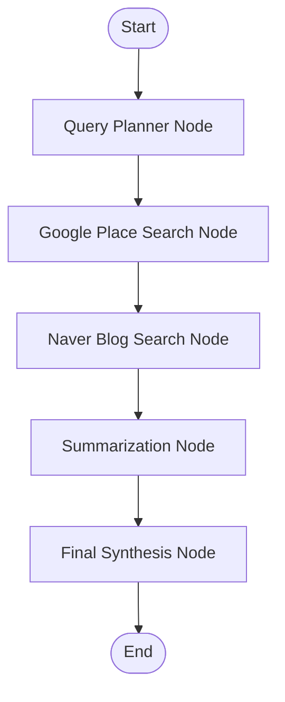

# Agent Workflow Architecture (Technical Overview)

이 문서는 `Google Team Project YoungJunKim` 저장소의 AI 에이전트(Agent)의 기술적인 아키텍처와 워크플로우를 다른 AI 시스템이 이해할 수 있도록 정직하고 상세하게 기술합니다.

## 시스템 개요
이 에이전트는 **LangGraph** 프레임워크를 기반으로 구축된 상태 기반(State-based) 비동기(Async) 워크플로우 시스템입니다. 
FastAPI의 비동기 이벤트 루프를 최대한 활용하여 고성능 병렬 처리를 수행하며, Google 및 Naver의 외부 데이터를 검색/요약하여 최종 답변을 생성합니다.

- **Framework**: LangGraph, FastAPI (Backend)
- **Model**: Gemini-1.5-flash (Google GenAI)
- **Architecture**: **Native Async Pipeline** (No blocking calls, No ThreadPool hacks)
- **Core Strategy**: `Planning -> Search -> Enrichment -> Summarization -> Synthesis`

---

## 1. Agent State Definition
에이전트의 모든 노드는 `AgentState`라는 공유 딕셔너리를 통해 데이터를 주고받습니다.

```python
class AgentState(TypedDict):
    messages: Sequence[BaseMessage]      # 채팅 메시지 기록
    current_step: str                    # 현재 실행 단계 구분
    tool_results: dict                   # (Optional) 도구 호출 결과
    query_plan: dict                     # QueryPlanner가 생성한 검색 계획
    place_data: list                     # Google Places API 검색 결과 (1차 raw 데이터)
    enriched_results: list               # Naver 리뷰/RSS가 결합된 통합 데이터
    summarized_results: list             # (New) LLM이 정제/요약한 핵심 데이터
    final_answer: str                    # 최종 LLM 답변 (JSON 형식)
    survey_data: dict                    # 사용자 선호 정보 (In-Memory DB에서 주입됨)
```

## 2. Main Workflow (LangGraph)

워크플로우는 **순차적 파이프라인(Sequential Pipeline)** 형태이며, 각 노드 내부에서는 **대규모 병렬 처리(Massive Parallelism)**가 수행됩니다.

### Flow Diagram


---

## 3. Node Details (Step-by-Step)

모든 노드는 `async def`로 정의되어 있으며, `await` 키워드를 통해 Non-blocking I/O를 수행합니다.

### Step 1: Query Planner Node (`query_planner_node.py`)
- **역할**: 사용자 질문(자연어)을 "검색 쿼리"로 변환합니다.
- **작동 방식**:
  - Gemini LLM에게 Structured Output(`QueryPlan`)을 비동기 요청(`ainvoke`)합니다.
  - 사용자의 의도를 분석하여 최적의 `place_queries`(검색어 리스트)를 생성합니다.

### Step 2: Google Place Search Node (`google_place_search_node.py`)
- **역할**: 장소의 기본 정보(위치, 평점, 주소)와 리뷰를 수집합니다.
- **작동 방식 (Native Async)**:
  - `aiohttp`를 사용하여 Google Places API를 병렬 호출합니다.
  - N개의 검색어 쿼리 동시 실행 -> M개의 장소 디테일 동시 조회를 수행하여 속도를 극대화합니다.
  - 외국어 가게 이름은 Gemini LLM을 통해 한글로 변환합니다.

### Step 3: Naver Blog Search Node (`naver_blog_search_node.py`)
- **역할**: 수집된 장소에 대해 한국인 리뷰(블로그)를 수집합니다.
- **작동 방식 (Native Async)**:
  - `GoogleSearch`에서 찾은 장소들에 대해 네이버 블로그 검색 API를 병렬 호출합니다.
  - 검색된 블로그 링크의 RSS 피드를 `aiohttp`로 병렬 다운로드합니다.
  - 결과는 `enriched_results`에 저장됩니다.

### Step 4: Summarization Node (`summarization_node.py` - **New**)
- **역할**: 수집된 방대한 블로그 Raw Data를 정제하고 요약합니다.
- **필요성**: 블로그 글 전체를 최종 프롬프트에 넣으면 토큰 예산(Cost/Limit) 문제가 발생하고 노이즈(광고 등)가 섞입니다.
- **작동 방식**:
  - 수집된 모든 블로그 글(수십 개)을 **동시에(Async Gather)** LLM에게 전송합니다.
  - 프롬프트: "광고 제거, 맛/분위기/팁 위주로 30% 분량으로 요약".
  - 결과는 `summarized_results`에 저장되며, 데이터 크기가 획기적으로 줄어듭니다.

### Step 5: LLM (Synthesis) Node (`llm_node.py`)
- **역할**: 정제된 정보(`summarized_results`)를 바탕으로 최종 답변을 작성합니다.
- **작동 방식**:
  - 요약된 데이터를 JSON 형식 작성을 위한 시스템 프롬프트(Context)로 변환합니다.
  - 최종적으로 사용자에게 추천 코스와 이유를 설명하는 JSON을 생성합니다.
  - `p1`, `p2` ID를 사용하여 프론트엔드 이미지 매핑을 지원합니다.

---

## 4. Technical Improvements (Refactoring Log)

이전 버전 대비 주요 개선 사항입니다.

1.  **Pure Async Architecture**:
    - [Before] `ThreadPoolExecutor` 안에서 `asyncio.run()`을 호출하는 Hack(편법) 사용 (FastAPI 충돌 회피용).
    - [After] 모든 노드를 `async def`로 리팩토링하고 `await agent_app.ainvoke()`를 사용하여 **완전한 비동기 시스템** 구축. 리소스 낭비 제거 및 코드 가독성 향상.

2.  **Intermediate Summarization**:
    - [Before] Raw 블로그 데이터를 그대로 Context에 주입 -> 3~4개 장소만 다뤄도 컨텍스트 꽉 참.
    - [After] **Summarization Node** 도입으로 데이터를 압축하여 더 많은 장소(10개 이상)를 비교 분석 가능해짐.

3.  **Parallel Processing**:
    - Google 검색, Naver 검색, 블로그 요약 등 모든 I/O 및 LLM 호출 구간에서 `asyncio.gather`를 활용한 병렬 처리가 적용됨.
