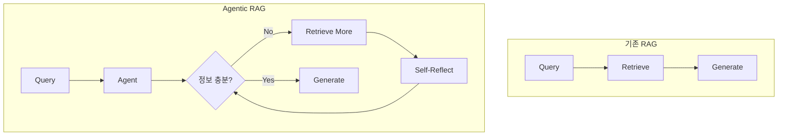
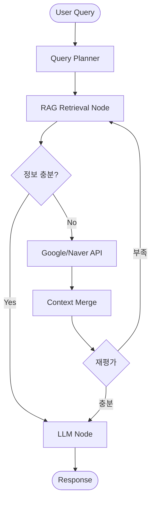
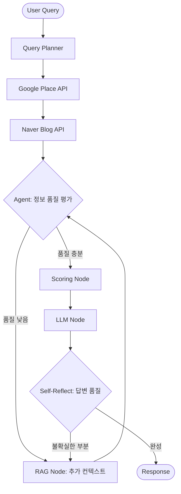
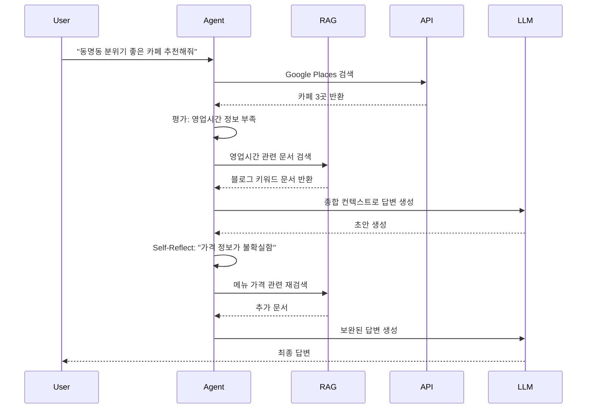

# Agentic RAG 도입 전략

> 기존 Gwangju-On 서비스에 **Agentic RAG**를 도입하여 더 지능적인 정보 검색 및 코스 생성을 가능하게 하는 전략 문서입니다.

---

## 📖 Agentic RAG란?

**Agentic RAG (Retrieval-Augmented Generation with Agent)** 는 기존 RAG의 "검색 → 생성" 단순 파이프라인을 넘어서, **LLM Agent가 스스로 판단하여 필요한 정보를 반복적으로 검색하고 보완**하는 고급 패턴입니다.

### 기존 RAG vs Agentic RAG

| 구분 | 기존 RAG | Agentic RAG |
|------|----------|-------------|
| **검색 방식** | Single-shot (1회 검색) | Iterative (반복 검색) |
| **검색 결정** | 사전 정의된 Rule | Agent가 동적 판단 |
| **컨텍스트 보완** | 없음 | 부족하면 재검색 수행 |
| **Self-Reflection** | 없음 | 검색 결과 품질 평가 후 재시도 |
| **복잡한 질문 대응** | 제한적 | Multi-hop Reasoning 가능 |



---

## 🎯 Gwangju-On에 Agentic RAG가 필요한 이유

현재 시스템의 한계:

1. **정적 파이프라인**: Query Planner → Google → Naver → Scoring → LLM 순서가 고정
2. **정보 부족 시 대응 불가**: 특정 장소의 리뷰가 부족해도 그대로 진행
3. **동적 보완 불가**: 사용자 질문에 따라 추가 정보가 필요해도 검색 불가

### 기대 효과

| Before | After (Agentic RAG) |
|--------|---------------------|
| 고정된 3개 쿼리로만 검색 | Agent가 부족하다 판단하면 추가 쿼리 생성 |
| 블로그 0건이면 그냥 넘어감 | 검색어를 변경하여 재시도 |
| 모든 장소에 동일한 정보량 | 중요 장소에 대해 심층 조사 수행 |

---

## 🗂️ RAG 데이터 설계: Keywords 직접 활용

사용자 질문: *"키워드 요소로 바로 임베딩하면 안 되나요? 굳이 다시 텍스트화해야 하나요?"*

**결론: 가능합니다!** 키워드 리스트나 JSON 그 자체를 임베딩해도 검색은 잘 동작합니다. 다만, **LLM이 이해하기 가장 좋은 '가성비' 형태**로 변환하는 것을 추천합니다.

### 데이터 변환 옵션 비교

| 옵션 | 방식 | 예시 | 장점 | 단점 |
|------|------|------|------|------|
| **1. 키워드 나열 (추천)** | **Key: Value** 형태 | `위치: 동명동, 메뉴: 크림새우, 감자전, 분위기: 레트로` | 토큰 절약, 검색 정확도 높음 | 문맥적 뉘앙스 일부 손실 |
| **2. 문장화 (Textify)** | 자연어 문장 생성 | `이곳은 동명동에 위치하며 크림새우가 유명합니다.` | LLM 이해도 최상 | 변환 비용 발생, 불필요한 조사/서술어 포함 |
| **3. Raw JSON** | JSON 문자열 그대로 | `{"location": ["동명동"], "menu": ["크림새우"]}` | 개발 편의성 높음 | 중괄호, 따옴표 등 특수문자가 노이즈가 될 수 있음 |

### ✅ 추천 방식: Compact Text (Option 1)

굳이 번거롭게 자연어 문장으로 만들 필요 없이, **키워드를 의미 단위로 묶어서** 임베딩하는 것이 효율적입니다.

```python
def _build_compact_document(post: dict) -> str:
    """키워드 중심의 간결한 문서 생성"""
    kw = post["keywords"]
    
    # 불필요한 조사는 빼고 핵심 정보만 나열
    lines = [
        f"제목: {post['metadata']['title']}",
        f"위치: {' '.join(kw.get('location', []))}",
        f"메뉴: {' '.join(kw.get('signature_menu', []))}",
        f"분위기: {' '.join(kw.get('ambiance', []))}",
        f"시설: {' '.join(kw.get('facilities', []))}"
    ]
    
    return "\n".join(lines)
```

---

## 🛠️ 구현 프레임워크 점검

현재 프로젝트(`pyproject.toml`)를 분석한 결과, **Agentic RAG를 구현하기 위한 핵심 라이브러리가 이미 모두 준비되어 있습니다.** 추가적인 무거운 프레임워크 도입은 필요 없습니다.

### 현재 보유한 도구 (Ready to use)

1.  **LangGraph** (`langgraph`)
    *   **역할**: Agent의 흐름 제어 (순환, 조건부 분기)
    *   **활용**: "검색 → 평가 → (재검색) → 생성"의 루프 구현 핵심
2.  **LangChain** (`langchain`, `langchain-google-genai`)
    *   **역할**: LLM 연동, 프롬프트 관리
    *   **활용**: Gemini 모델 호출 및 데이터 체인 연결
3.  **FAISS** (`faiss-cpu`)
    *   **역할**: Vector Store (로컬)
    *   **활용**: 임베딩된 데이터를 빠르게 검색 (굳이 Vertex AI Vector Search가 아니더라도 로컬에서 충분히 가능)

### 결론

> **"새로운 프레임워크 설치 불필요"**
>
> 현재 설치된 `LangGraph` + `FAISS` 조합이면 충분히 강력한 Agentic RAG를 만들 수 있습니다. 복잡도를 높이지 말고 현재 스택을 유지하는 것을 권장합니다.

---

## 🏗️ 아키텍처 제안: Agentic RAG 통합

### Option 1: RAG-First 접근법

> **먼저 RAG로 관련 장소 정보를 검색한 후**, 실시간 API로 보완



**장점:**
- 빠른 응답 속도 (Vector Search가 API 호출보다 빠름)
- API 호출 비용 절감
- 오프라인 정보 기반으로 안정적

**단점:**
- Vector Store 최신성 유지 필요
- 초기 데이터 구축 비용

---

### Option 2: RAG-as-Enrichment 접근법 (권장 ⭐)

> **기존 API 우선 파이프라인 유지**, RAG는 컨텍스트 보강 역할



**장점:**
- 기존 파이프라인 유지하면서 점진적 도입 가능
- API로 최신 정보, RAG로 풍부한 컨텍스트 확보
- 코드 변경 최소화

**단점:**
- 복잡한 조건 분기 로직 필요
- Agent 판단 기준 설정 필요

---

## 🛠️ 구현 가이드: RAG Node 추가

### 1. 새로운 State 필드 추가

```python
# state.py에 추가
class AgentState(TypedDict):
    # ... 기존 필드들 ...
    
    # RAG 관련 필드
    rag_context: List[Dict]      # RAG에서 검색한 문서들
    retrieval_count: int          # 검색 시도 횟수 (무한루프 방지)
    context_quality: str          # "sufficient" | "insufficient"
```

### 2. RAG Retrieval Node 구현

```python
# nodes/rag_retrieval_node.py

from google.cloud import aiplatform
from vertexai.preview.language_models import TextEmbeddingModel

class RAGRetrievalNode:
    def __init__(self):
        self.embedding_model = TextEmbeddingModel.from_pretrained("text-embedding-004")
        self.vector_store = self._load_vector_store()
    
    def __call__(self, state: AgentState) -> AgentState:
        """RAG 검색 수행"""
        query = state["messages"][-1]
        
        # 1. 쿼리 임베딩 생성
        query_embedding = self.embedding_model.get_embeddings([query])[0].values
        
        # 2. Vector Search
        similar_docs = self.vector_store.similarity_search(
            query_embedding,
            top_k=5,
            filter={"category": "restaurant"}
        )
        
        # 3. 검색 결과를 State에 추가
        state["rag_context"].extend(similar_docs)
        state["retrieval_count"] += 1
        
        return state
```

### 3. 품질 평가 노드 (Reflection)

```python
# nodes/context_evaluator_node.py

class ContextEvaluatorNode:
    def __init__(self):
        self.llm = ChatGoogleGenerativeAI(model="gemini-2.0-flash")
    
    def __call__(self, state: AgentState) -> AgentState:
        """컨텍스트 품질 평가 및 추가 검색 결정"""
        
        prompt = f"""
        사용자 질문: {state["messages"][-1]}
        
        수집된 정보:
        - Google Places: {len(state.get("place_data", []))}건
        - Naver Blogs: {len(state.get("enriched_results", []))}건  
        - RAG Documents: {len(state.get("rag_context", []))}건
        
        다음을 평가해주세요:
        1. 사용자 질문에 충분히 답변 가능한가? (Yes/No)
        2. 부족한 정보 유형은? (메뉴, 분위기, 위치, 영업시간 등)
        3. 추가 검색이 필요한가?
        
        JSON 형식으로 응답:
        {{"sufficient": true/false, "missing": ["..."], "should_retrieve": true/false}}
        """
        
        result = self.llm.invoke(prompt)
        evaluation = json.loads(result.content)
        
        state["context_quality"] = "sufficient" if evaluation["sufficient"] else "insufficient"
        
        return state
```

### 4. 그래프 수정

```python
# graph.py 수정

from langgraph.graph import StateGraph, END

def build_graph():
    graph = StateGraph(AgentState)
    
    # 기존 노드들
    graph.add_node("query_planner", query_planner_node)
    graph.add_node("google_search", google_place_node)
    graph.add_node("naver_blog", naver_blog_node)
    graph.add_node("scoring", scoring_node)
    graph.add_node("llm", llm_node)
    
    # 새로운 RAG 노드들
    graph.add_node("rag_retrieval", rag_retrieval_node)
    graph.add_node("context_evaluator", context_evaluator_node)
    
    # 엣지 정의
    graph.add_edge("query_planner", "google_search")
    graph.add_edge("google_search", "naver_blog")
    graph.add_edge("naver_blog", "context_evaluator")
    
    # 조건부 분기: 정보 충분하면 Scoring, 아니면 RAG
    graph.add_conditional_edges(
        "context_evaluator",
        lambda state: state["context_quality"],
        {
            "sufficient": "scoring",
            "insufficient": "rag_retrieval"
        }
    )
    
    graph.add_edge("rag_retrieval", "context_evaluator")  # 재평가
    graph.add_edge("scoring", "llm")
    graph.add_edge("llm", END)
    
    return graph.compile()
```

---

## 🔄 Iterative Refinement 패턴

Agent가 **답변 생성 중에도** 부족한 정보를 발견하면 재검색할 수 있습니다.



---

## 📊 Vector Store 구축 방안

### Vertex AI Vector Search 활용

```python
# scripts/build_vector_store.py

from google.cloud import aiplatform
from vertexai.preview.language_models import TextEmbeddingModel
import json

def build_embeddings():
    # 1. extracted_keywords.json 로드
    with open("extracted_keywords.json", "r") as f:
        data = json.load(f)
    
    model = TextEmbeddingModel.from_pretrained("text-embedding-004")
    documents = []
    
    # 2. 각 포스트를 문서로 변환
    for post in data["posts"]:
        content = _build_document_content(post)
        embedding = model.get_embeddings([content])[0].values
        
        documents.append({
            "id": post["metadata"]["link"],
            "content": content,
            "embedding": embedding,
            "metadata": post["metadata"]
        })
    
    # 3. Vertex AI Vector Search Index 생성
    index = aiplatform.MatchingEngineIndex.create_tree_ah_index(
        display_name="gwangju-on-rag-index",
        dimensions=768,  # text-embedding-004의 차원
        approximate_neighbors_count=10
    )
    
    return index

def _build_document_content(post: dict) -> str:
    """포스트 키워드를 자연어 문서로 변환"""
    kw = post["keywords"]
    parts = []
    
    if kw.get("location"):
        parts.append(f"위치: {', '.join(kw['location'])}")
    if kw.get("hours"):
        parts.append(f"영업시간: {', '.join(kw['hours'])}")
    if kw.get("signature_menu"):
        parts.append(f"대표 메뉴: {', '.join(kw['signature_menu'])}")
    if kw.get("ambiance"):
        parts.append(f"분위기: {', '.join(kw['ambiance'])}")
    
    return f"{post['metadata']['title']}. " + ". ".join(parts)
```

---

## ⚙️ 설정 및 제한 사항

### 무한 루프 방지

```python
MAX_RETRIEVAL_ATTEMPTS = 3

def should_continue_retrieval(state: AgentState) -> str:
    if state["retrieval_count"] >= MAX_RETRIEVAL_ATTEMPTS:
        return "proceed"  # 강제로 다음 단계로
    if state["context_quality"] == "sufficient":
        return "proceed"
    return "retrieve_more"
```

### 비용 최적화

| 단계 | 비용 요소 | 최적화 방안 |
|------|-----------|-------------|
| Embedding | API 호출 | 배치 처리, 캐싱 |
| Vector Search | 쿼리당 비용 | Top-K 제한, 필터 활용 |
| LLM Reflection | 토큰 비용 | 짧은 프롬프트, Flash 모델 |

---

## 📅 도입 로드맵

### Phase 1: 데이터 준비 (1주)
- [ ] `extracted_keywords.json` → Vector 형식 변환
- [ ] Vertex AI Vector Search Index 생성
- [ ] 임베딩 생성 스크립트 작성

### Phase 2: RAG Node 구현 (1주)
- [ ] `RAGRetrievalNode` 구현
- [ ] `ContextEvaluatorNode` 구현
- [ ] State 확장

### Phase 3: 그래프 통합 (3일)
- [ ] 조건부 엣지 추가
- [ ] 무한 루프 방지 로직
- [ ] 통합 테스트

### Phase 4: Self-Reflection 추가 (선택)
- [ ] LLM 답변 품질 평가 노드
- [ ] 동적 재검색 트리거

---

## 🎓 참고 자료

- [LangGraph: Agentic RAG](https://langchain-ai.github.io/langgraph/tutorials/rag/langgraph_agentic_rag/)
- [Vertex AI Vector Search](https://cloud.google.com/vertex-ai/docs/vector-search/overview)
- [Corrective RAG (CRAG)](https://arxiv.org/abs/2401.15884) - Self-Corrective 패턴
- [Self-RAG](https://arxiv.org/abs/2310.11511) - Reflection 기반 RAG
