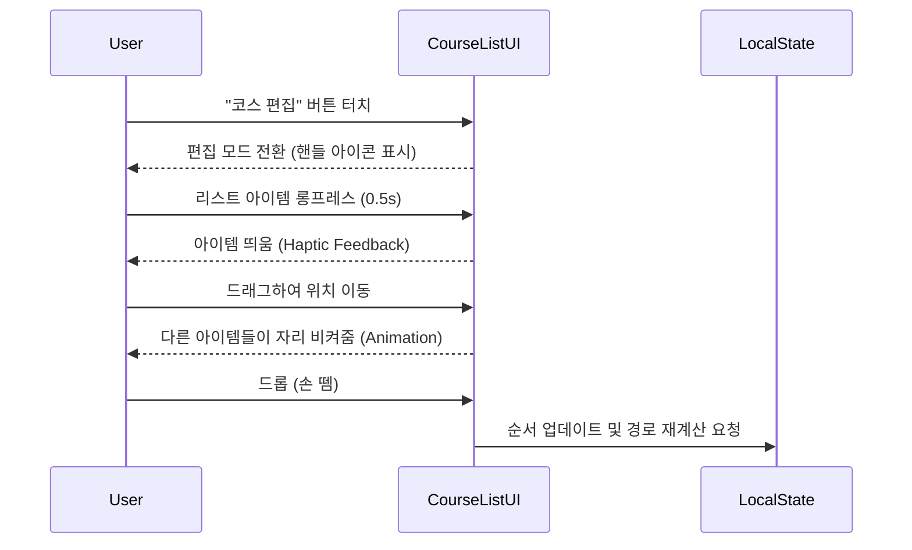

# 여행 코스 수정 기능 UX/UI 설계 보고서

## 1. 개요 (Overview)

본 문서는 'Gwangju-On' 서비스의 모바일 웹 환경에서 **사용자가 AI가 생성한 여행 코스를 자유롭게 편집할 수 있는 기능**을 구현하기 위한 UX/UI 설계 가이드입니다.

### 🎯 설계 목표
1.  **직관성**: 모바일 터치 환경(좁은 화면)에서도 오동작 없이 쉽게 순서를 바꾸거나 장소를 삭제할 수 있어야 함.
2.  **연속성**: 수정 중에도 지도(Map)와 리스트(List) 간의 시각적 동기화가 실시간으로 이루어져야 함.
3.  **안전성**: 실수로 인한 코스 삭제를 방지하고, 수정 사항을 안전하게 저장해야 함.

---

## 2. 핵심 기능별 UX/UI 설계

### ① 코스 순서 변경 (Reordering)

모바일에서 가장 직관적인 **Long-press & Drag** 방식을 채택합니다.

#### 🔄 User Flow


#### 📱 UI Layout & Components
*   **진입점**: Bottom Sheet 상단의 `편집(Edit)` 텍스트 버튼.
*   **리스트 아이템 (Tailwind CSS)**:
    ```tsx
    // 편집 모드 활성화 시 스타일
    <motion.div
      layout
      whileHover={{ scale: 1.02 }}
      whileTap={{ scale: 1.05, boxShadow: "0px 10px 20px rgba(0,0,0,0.2)" }}
      className="flex items-center gap-3 p-3 bg-white border border-gray-200 rounded-xl mb-2"
    >
      {/* Drag Handle Icon */}
      <div className="text-gray-400 cursor-grab active:cursor-grabbing p-2">
        <GripVertical size={20} />
      </div>
      
      {/* Content */}
      <div className="flex-1">
        <h3 className="font-bold text-gray-900">{place.name}</h3>
        <p className="text-xs text-gray-500">{place.category}</p>
      </div>
      
      {/* Delete Button */}
      <button className="text-red-500 p-2 bg-red-50 rounded-full">
        <Trash2 size={16} />
      </button>
    </motion.div>
    ```
*   **기술 스택 권장**:
    *   `framer-motion`: `Reorder.Group` 컴포넌트를 사용하여 부드러운 애니메이션 구현.
    *   모바일 브라우저의 'Pull-to-refresh'와 충돌하지 않도록 `touch-action: none` 적용 필수.

---

### ② 지도 기반 장소 변경 (Map Interaction)

지도를 보면서 직관적으로 경유지를 추가하거나 변경하는 UX입니다.

#### 🗺️ Interaction Design
1.  **기존 장소 터치 (In Edit Mode)**:
    *   기존 마커 터치 시 **Context Menu** (Bottom Sheet) 호출.
    *   옵션: `순서 변경`, `삭제`, `다른 장소로 교체`.
2.  **지도 빈 곳 터치 (POI Selection)**:
    *   TMAP 상의 POI(주변 건물) 터치 시 간단한 정보 카드 표시.
    *   **"이 장소 추가"** 버튼 제공 -> 현재 코스의 **마지막** 또는 **현재 선택된 단계 다음**에 추가.

#### 📱 Context Menu Component
```tsx
// 편집 모드에서 마커 클릭 시 하단에 뜨는 메뉴
<div className="fixed bottom-0 left-0 right-0 bg-white rounded-t-2xl p-6 shadow-2xl z-[2000] animate-slide-up">
    <h3 className="text-lg font-bold mb-4">{selectedPlace.name}</h3>
    <div className="grid grid-cols-2 gap-3">
        <button className="flex flex-col items-center justify-center p-4 bg-gray-50 rounded-xl gap-2 active:bg-gray-100">
            <Replace size={24} className="text-blue-500"/>
            <span className="text-sm font-bold text-gray-700">장소 교체</span>
        </button>
        <button className="flex flex-col items-center justify-center p-4 bg-red-50 rounded-xl gap-2 active:bg-red-100">
            <Trash2 size={24} className="text-red-500"/>
            <span className="text-sm font-bold text-red-600">삭제</span>
        </button>
    </div>
</div>
```

---

### ③ 상세 정보 내 수정 (Detail View Editing)

코스의 세부 내용을 확인하다가 마음에 들지 않는 장소를 발견했을 때 바로 수정하는 워크플로우입니다.

#### 🔍 Workflow
1.  Bottom Sheet의 코스 상세 리스트에서 특정 장소의 **'교체(Replace)'** 버튼 클릭.
2.  **장소 검색 모달(Search Modal)** 오픈.
3.  키워드 검색 (예: "동명동 카페") 또는 카테고리 추천 리스트 표시.
4.  검색 결과 선택 시, 기존 장소가 새로운 장소로 대체됨.
5.  **경로 및 소요시간 자동 재계산**.

#### 📱 Search Modal UI
*   **Header**: 검색창 (`<input autoFocus />`) + 닫기 버튼.
*   **Body**: 
    *   **최근 검색어** / **AI 추천 대체 장소** (같은 카테고리의 근처 평점 높은 곳).
    *   검색 결과 리스트 (평점, 거리, 썸네일 포함).

---

## 3. 상태 관리 및 데이터 동기화 전략

프론트엔드 상태와 백엔드 데이터의 일관성을 유지하기 위한 전략입니다.

### 🔄 Optimistic UI Update (낙관적 업데이트)
사용자가 코스를 수정할 때마다 서버 응답을 기다리면 UX가 끊깁니다.

1.  **Local State 즉시 반영**:
    *   Drag Drop 완료 즉시 `spots` state 순서 변경.
    *   지도 상의 Polyline(경로)은 잠시 숨기거나 '재계산 중' 점선으로 표시.
2.  **Debounced Save**:
    *   사용자의 수정이 멈춘 후 1~2초 뒤에 서버로 `PUT /api/user/courses/{id}` 요청 전송.
    *   또는 '편집 완료' 버튼을 눌렀을 때 일괄 전송.
3.  **Route Recalculation**:
    *   장소 변경이 확정되면 TMAP API를 호출하여 경로(Polyline)와 총 소요 시간(`totalTime`)을 백그라운드에서 다시 계산하여 업데이트.

### 💾 Data Structure for Edit
```typescript
interface EditableCourse {
  id: string;
  isDirty: boolean; // 수정 사항이 저장되지 않았는지 여부
  places: CoursePoint[];
  originalPlaces: CoursePoint[]; // 취소 시 복구용
}
```

---

## 4. 구현 로드맵 (Action Items)

### Phase 1: 드래그 앤 드롭 (Reordering)
- [ ] `framer-motion` 설치 및 `Reorder` 컴포넌트 학습.
- [ ] `MapView.tsx`의 Bottom Sheet 내 리스트를 `Reorder.Group`으로 래핑.
- [ ] 편집 모드 토글 상태(`isEditMode`) 추가.

### Phase 2: 장소 삭제 및 추가
- [ ] 리스트 아이템에 삭제 버튼 추가.
- [ ] 지도 마커 클릭 이벤트 핸들러 확장 (편집 모드 분기 처리).

### Phase 3: 장소 교체 및 검색
- [ ] `PlaceSearchModal.tsx` 컴포넌트 구현.
- [ ] TMAP POI 검색 API 연동.

### Phase 4: 저장 및 동기화
- [ ] 코스 변경 시 `localStorage` 업데이트 로직 추가.
- [ ] '저장하기' 버튼 구현 및 백엔드 연동.

---
**작성자**: Senior System Architect & UX Lead
**날짜**: 2026-02-02
