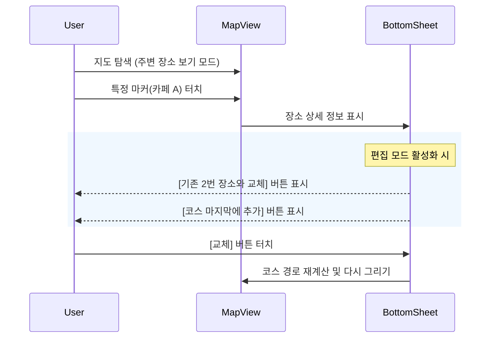

# 지도 상호작용 기반 코스 수정 기능 기술 분석 보고서

## 1. 마커 드래그를 통한 장소 변경 (Drag & Drop Marker)

### 💡 개념
사용자가 지도 위에 표시된 코스 마커(예: '1번 장소')를 롱프레스하여 드래그 상태로 만들고, 원하는 다른 건물이나 위치 위로 드롭하여 해당 장소로 코스를 변경하는 방식입니다.

### 🛠 기술적 구현 가능성
1.  **Draggable Marker**: TMAP API의 `Marker` 객체는 `draggable: true` 옵션을 지원하므로 구현 자체는 가능합니다.
2.  **좌표 획득**: 드롭 이벤트(`dragend`) 발생 시 변경된 위/경도(`lat`, `lng`)를 즉시 얻을 수 있습니다.

### ⚠️ 한계 및 문제점 (Limits)
1.  **장소 식별의 모호성 (Ambiguity)**:
    *   사용자가 특정 건물을 의도하고 드롭했더라도, 시스템은 단지 '좌표'만 알 수 있습니다.
    *   해당 좌표에 여러 상점(1층 카페, 2층 식당 등)이 겹쳐 있을 경우, 어떤 장소로 변경하려 했는지 명확히 파악하기 어렵습니다.
2.  **추가 API 호출 필수 (Reverse Geocoding)**:
    *   드롭된 좌표를 '장소명(POI)'으로 변환하기 위해 서버에 역지오코딩(Reverse Geocoding) 또는 장소 검색 API를 호출해야 합니다.
    *   이 과정에서 딜레이가 발생하며, 정확한 상호명을 가져오지 못하고 "OO로 123번길" 같은 주소만 반환될 위험이 큽니다.
3.  **모바일 UX 간섭**:
    *   모바일 지도에서 드래그 제스처는 '지도 이동(Panning)'과 충돌하기 쉽습니다. 마커를 정확히 잡고 끄는 동작은 손가락이 화면을 가려 정밀도를 떨어뜨립니다.

---

## 2. POI 클릭을 통한 추가/대체 (Touch & Select)

### 💡 개념 (네이버 지도 방식)
사용자가 지도를 탐색하다가 관심 있는 장소(POI)나 검색된 핀을 터치하면, 간략한 정보 카드와 함께 **"코스에 추가"** 또는 **"이 장소로 교체"** 버튼을 제공하는 방식입니다.

### 🚀 기술적 타당성 (Feasibility)
1.  **명확한 데이터 확보**:
    *   이미 검색된 POI(Marker)를 클릭하는 경우, 해당 객체는 `name`, `id`, `category` 등 완전한 메타데이터를 가지고 있습니다. 모호함이 전혀 없습니다.
2.  **이벤트 처리 용이성**:
    *   `Marker`의 `click` 또는 `touchend` 이벤트는 매우 안정적으로 동작합니다.
    *   배경 지도(Base Map)의 심볼을 클릭하는 경우(TMAP JS API 한계), 클릭한 좌표 주변을 검색하는 API(`searchAround`)를 호출하여 가장 가까운 장소를 찾아줄 수 있습니다.

### 🔄 UX 흐름 (UX Flow)

---

## 3. 종합 의견 및 제안

| 비교 항목 | 마커 드래그 (Drag Marker) | POI 클릭 (Touch Select) |
| :--- | :--- | :--- |
| **직관성** | 높음 (물리적 이동) | 보통 (UI 조작 필요) |
| **정확도** | **낮음** (좌표 기반 추측) | **높음** (데이터 기반 선택) |
| **구현 난이도** | 높음 (좌표→장소 변환 로직 복잡) | 낮음 (기존 이벤트 활용) |
| **모바일 적합성** | 낮음 (터치 간섭, 손가락 가림) | **높음** (터치 친화적) |

### ✅ 결론: POI 클릭 방식 권장
**'POI 클릭을 통한 추가/대체'** 방식이 기술적 안정성과 사용자 경험 측면에서 훨씬 우수합니다. 특히 상가 밀집 지역이 많은 여행지 특성상, 드래그보다는 명확한 장소를 선택하는 방식이 오류를 줄일 수 있습니다.

**구현 제안**:
1.  **편집 모드**에서 지도 상의 다른 장소(검색 결과 등)를 터치하면, 하단 시트에 `교체하기` 버튼을 활성화합니다.
2.  TMAP의 배경 심볼 클릭은 기술적 제약이 있으므로, **"현 지도에서 검색"** 기능을 통해 화면에 마커를 뿌려주고 이를 선택하게 하는 흐름이 가장 자연스럽습니다.
