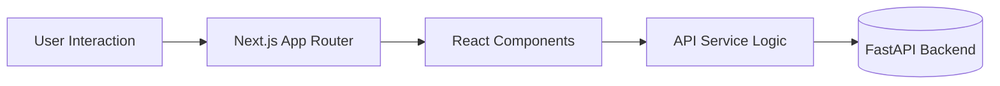

# Frontend Architecture & Implementation Details

이 문서는 Gwangju-On Frontend(`Next.js`)의 구조, 상태 관리, 그리고 Backend와의 데이터 연동 흐름을 상세하게 설명합니다. Chat UI와 Map API 통합 로직이 집중적으로 다뤄집니다.

---

## 🏗 아키텍처 (Architecture)

Frontend는 **Next.js 15 (App Router)**를 기반으로 하며, 사용자 인터랙션 중심의 **SPA(Single Page Application)** 경험을 제공합니다.



### 주요 기술 스택
*   **Next.js 15**: 서버 사이드 렌더링(SSR) 및 라우팅.
*   **TypeScript**: 정적 타입 안정성 보장.
*   **Tailwind CSS**: 유틸리티 우선의 스타일링 시스템.
*   **TMAP API**: 지도 시각화 및 경로 탐색.

---

## 📂 페이지 및 컴포넌트 구조

```
frontend/
├── app/                  # App Router Pages
│   ├── chat/             # 채팅 페이지 (page.tsx)
│   ├── map/              # 지도 페이지 (page.tsx)
│   ├── survey/           # 설문 페이지
│   └── ...
├── screens/              # 비즈니스 로직이 포함된 화면 단위 컴포넌트
│   ├── ChatScreen.tsx    # 채팅 UI 및 메시지 상태 관리
│   ├── MapView.tsx       # TMAP 초기화 및 마커 렌더링
│   └── SurveyScreen.tsx  # 사용자 취향 설문 폼
└── services/             # API 통신 레이어
    └── geminiService.ts  # Backend 통신 어댑터
```

---

## 🧠 핵심 로직 상세

### 1. 채팅 시스템 (`ChatScreen.tsx`)

사용자와 AI Agent 간의 대화를 관리하는 화면입니다.

*   **상태 관리 (`useSafeState`)**:
    *   `messages: Message[]`: 대화 목록을 배열로 관리.
    *   `loading`: AI 응답 대기 상태 표시 (스켈레톤 UI).
*   **메시지 전송 흐름**:
    1.  사용자 입력 -> `aiService.processRequest(input)` 호출.
    2.  서버 응답 확인 (`isDecisionPoint` 체크).
    3.  **코스 생성 시 (`isDecisionPoint: true`)**:
        *   Backend로부터 3가지 추천 코스(`allCourses`)를 받습니다.
        *   현재 선택된 코스(기본값: 첫 번째)를 `localStorage`의 `current_course` 키로 저장.
        *   전체 후보 코스를 `localStorage`의 `all_courses` 키로 저장.
        *   이미지 URL을 미리 로딩(Preload)하여 UX를 개선.
        *   `router.push('/map')`으로 지도 화면 자동 이동.

### 2. 지도 시각화 (`MapView.tsx`)

생성된 코스를 TMAP 위에 시각화하고 경로를 탐색합니다.

*   **초기화 (`initMap`)**:
    *   `window.Tmapv3` 객체 유무 확인.
    *   `localStorage`에서 `current_course` 데이터를 불러와 지도 중심 설정.
*   **마커 렌더링**:
    *   `current_course` 배열을 순회하며 `Tmapv3.Marker` 생성.
    *   HTML 마커를 사용하여 숫자가 적힌 커스텀 핀 구현.
*   **경로 탐색 (`fetchRoute`)**:
    *   T-Map 보행자/자동차 경로 API 호출 (`pedestrian` / `car`).
    *   반환된 좌표 리스트를 `Tmapv3.Polyline`으로 그려 지도 위에 경로 표시.
    *   총 소요 시간(분) 계산 및 표시.

### 3. API 서비스 (`services/geminiService.ts`)

Backend API와의 통신을 담당하는 어댑터 패턴의 클래스입니다.

```typescript
// 예제 코드
async processRequest(input: string): Promise<Message> {
  const userId = localStorage.getItem('temp_user_id'); // 세션 ID 조회
  
  const response = await fetch(`${this.apiUrl}/chat`, {
    method: 'POST',
    body: JSON.stringify({ message: input, userId }),
    // ...
  });
  
  // Backend 응답을 Frontend Message 타입으로 변환
  const data = await response.json();
  return {
    id: data.id,
    role: 'assistant',
    text: data.text,
    evidenceCards: data.evidenceCards, // 첫 번째 코스 (레거시)
    allCourses: data.allCourses,       // 3개 코스 전체 (신규)
    // ...
  };
}
```

---

## 🔗 데이터 연동 (Data Flow)

### Chat Flow
1.  **Survey**: 사용자 취향 분석 -> `userId` 생성 및 Backend 전송.
2.  **User Input**: "데이트 코스 추천해줘"
3.  **Backend Processing**: Agent가 3가지 테마의 코스 JSON 생성.
4.  **Frontend Receive**: 
    ```json
    {
      "allCourses": [
        { "course_id": 1, "course_name": "맛집 코스", "cards": [...] },
        { "course_id": 2, "course_name": "힐링 코스", "cards": [...] },
        ...
      ]
    }
    ```
5.  **Storage**: 위 데이터를 `localStorage`에 저장.
6.  **Map Transition**: 지도 페이지 로드 시 Storage에서 읽어서 핀 찍기.

---

## ⚠️ 프론트엔드 유의사항

1.  **SSR & Window Object**: TMAP 스크립트는 브라우저 환경에서만 동작하므로, `useEffect` 내부나 `typeof window !== 'undefined'` 체크가 필수입니다.
2.  **Environment Variables**:
    *   `NEXT_PUBLIC_API_URL`: 백엔드 주소 (기본: `http://localhost:8000/api`).
    *   `NEXT_PUBLIC_TMAP_APP_KEY`: TMAP 발급 키.
    *   **주의**: `process.env` 변수는 빌드 타임에 주입되므로 `.env.local` 파일 확인 필요.
3.  **CORS**: 이미지 로딩 시 `http://localhost:8000/api/photo` 프록시를 사용하여 렌더링해야 엑박이 뜨지 않습니다.
