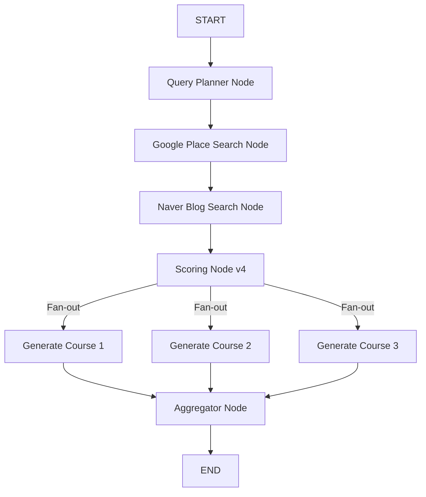

# AI Agent 상세 구조 및 데이터 흐름

이 문서는 Gwangju-On 서비스의 핵심인 AI Agent의 내부 동작 과정을 상세하게 설명합니다. LangGraph를 기반으로 구성된 Agent가 **Frontend의 설문 데이터**를 어떻게 활용하며, **Backend**를 통해 어떤 데이터를 주고받는지 자세히 다룹니다.

---

## 🏗 전체 파이프라인 (LangGraph Workflow)

Agent는 다음과 같은 **병렬 처리(Parallel Processing)** 구조로 동작하여 3가지 테마의 코스를 동시에 생성합니다.



---

## 🔗 Frontend ↔ Backend 데이터 연동 구조 (Integration)

사용자의 경험은 **설문조사(Survey)**에서 시작하여 **채팅(Chat)**으로 이어집니다. 이 과정에서 데이터가 어떻게 전달되고 활용되는지 확인해보겠습니다.

### 1단계: 사용자 프로필 및 취향 분석 (Survey)
**Frontend** (`SurveyScreen.tsx`) -> **Backend** (`api/user.py`)

사용자가 앱을 처음 실행하면 닉네임과 설문조사를 진행합니다. 이 데이터는 나중에 AI가 맞춤형 코스를 짤 때 핵심적인 단서가 됩니다.

1.  **Request (`POST /api/user/survey`)**:
    ```json
    {
      "userId": "user_12345",
      "gender": "female",
      "age": "20s",
      "themes": ["healing", "instagrammable"],
      "companions": ["couple"],
      "budget": "medium"
    }
    ```
2.  **Backend 저장**:
    *   `USER_DB` (In-Memory Dictionary)에 `userId`를 키(Key)로 하여 저장됩니다.

---

### 2단계: AI 채팅 요청 (Chat Request)
**Frontend** (`ChatScreen.tsx`) -> **Backend** (`api/chat.py`)

사용자가 구체적인 장소나 코스를 추천해달라고 채팅을 보냅니다.

1.  **Request (`POST /api/chat`)**:
    ```json
    {
      "userId": "user_12345",     // 이 ID로 서버에 저장된 취향을 찾습니다.
      "message": "동명동 분위기 좋은 카페 갔다가 저녁 먹을만한 식당 추천해줘"
    }
    ```
2.  **Backend 처리**:
    *   `USER_DB`에서 `user_12345`의 설문 데이터(`survey_data`)를 조회합니다.
    *   Agent Graph를 실행할 때 `messages`와 `survey_data`를 함께 주입합니다.

---

## 🧩 3단계: AI Agent 내부 처리 상세 (Node Processing)

이제 LangGraph 내부에서 데이터가 어떻게 변환되는지 단계별로 살펴봅니다.

### ① Query Planner Node (검색 계획 수립)
사용자의 자연어 질문과 **설문 데이터(Context)**를 함께 고려하여 검색어를 생성합니다. `Structured Output` 기능을 사용하여 정해진 포맷의 계획을 수립합니다.

*   **Prompt Input (LLM에 들어가는 정보)**:
    *   사용자 정보 (성별, 나이, 여행 테마, 동행인)
    *   사용자 질문 (Last Message)

*   **Output (JSON Plan)**:
    ```json
    {
      "themes": ["맛집", "데이트", "힐링"],
      "place_queries": ["광주 동명동 인스타 감성 카페", "광주 동명동 분위기 좋은 데이트 맛집"],
      "result_count": 20,
      "reasoning": "20대 여성 사용자가 연인과 가기 좋은 '인스타 감성' 카페와 '분위기 좋은' 맛집을 각각 검색."
    }
    ```

### ② Google Place Search Node (장소 기본 정보 수집)
계획된 쿼리로 구글 지도 API를 검색합니다. 평점, 리뷰 수, 사진 ID, 좌표 등을 가져옵니다.

*   **입력**: `["광주 동명동 인스타 감성 카페", ...]`
*   **출력 (`place_data`)**: Place Object List (ID, Name, Lat/Lng, Rating, Photo)

### ③ Naver Blog Search Node (심층 리뷰 Enrichment)
장소 이름으로 네이버 블로그를 검색하고 RSS 내용을 긁어와 사용자 리뷰의 질을 높입니다.

*   **입력**: `place_data` 리스트
*   **출력 (`enriched_results`)**: Place Data + Blog Reviews (Full Text)

### ④ Scoring Node v4 (하이브리드 스코어링 시스템)
**정량적 평가(API 데이터)**와 **정성적 평가(LLM 감성 분석)**를 결합하여 가장 적합한 장소를 선정합니다. **Batch Processing**을 통해 LLM 호출 비용과 시간을 최적화했습니다.

*   **1. 정량적 평가 (Base Score)**:
    *   공공 데이터(모범 음식점) 및 Google 평점/리뷰수 기반.
*   **2. 정성적 평가 (LLM Sentiment Score - V4)**:
    *   LLM이 Google 리뷰와 Naver 블로그 요약을 읽고 4가지 차원을 평가합니다.
    *   **맛 (Taste)**, **서비스/분위기 (Service)**, **가성비 (Value)**, **재방문 의사 (Revisit)**
*   **출력 (`scored_results`)**: 점수 순으로 정렬된 장소 리스트.

### ⑤ Parallel Course Generation (병렬 코스 생성)
`Query Planner`에서 선정한 3가지 테마(`themes`)에 맞춰 각각의 코스를 생성하는 3개의 노드가 **동시에 실행**됩니다.

*   **Generate Course 1**: 테마 1 (예: "맛집 코스") 생성
*   **Generate Course 2**: 테마 2 (예: "데이트 코스") 생성
*   **Generate Course 3**: 테마 3 (예: "힐링 코스") 생성

각 노드는 `scored_results`에서 해당 테마에 가장 적합한 장소들을 선별하여 코스를 구성합니다.

### ⑥ Aggregator Node (결과 취합)
병렬로 생성된 3개의 코스를 하나의 JSON 응답으로 합칩니다.

*   **Final Output (JSON)**:
    ```json
    {
      "answer": "동명동의 핫한 장소들을 모아 3가지 코스로 준비했어요! 💖",
      "recommended_courses": [
        {
          "course_id": 1,
          "course_name": "맛집 탐방 코스",
          "places": [ ... ]
        },
        {
          "course_id": 2,
          "course_name": "데이트 코스",
          "places": [ ... ]
        },
        {
          "course_id": 3,
          "course_name": "힐링 코스",
          "places": [ ... ]
        }
      ]
    }
    ```

---

## 4단계: 결과 반환 (Response Parsing)
**Backend** (`api/chat.py`) -> **Frontend**

Backend는 Agent가 뱉어낸 JSON을 파싱하여 Frontend로 전달합니다. `isDecisionPoint: true` 플래그를 통해 사용자가 지도로 이동하여 상세 코스를 확인할 수 있도록 유도합니다.

---

## 🔍 Mini Agent
간단한 장소 검색이나 빠른 응답이 필요할 때 사용할 수 있는 경량화 에이전트입니다. (`src/mini_agent/`)
자세한 구조는 `mini_agent_structure.md`를 참고하세요.
