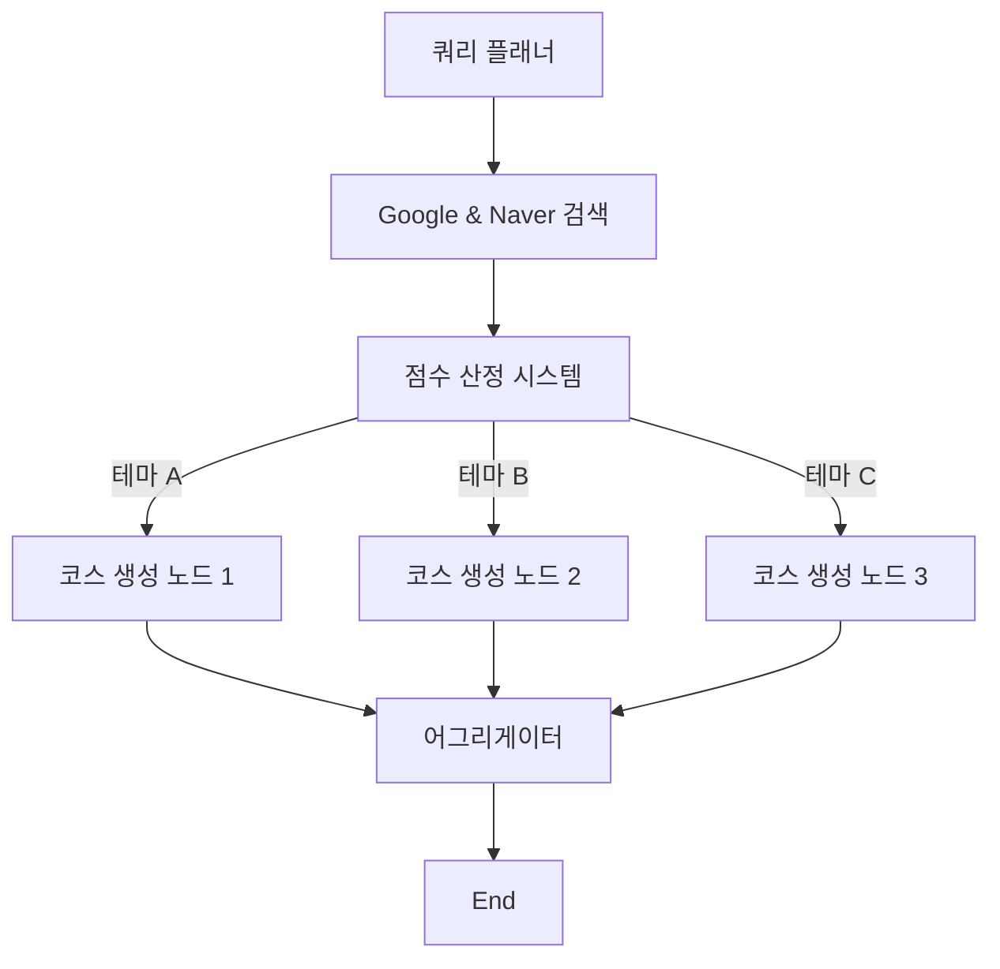

# AI 에이전트 V2 업그레이드: 병렬 코스 생성

## 1. 개요
코스 생성 프로세스를 단일 스레드 순차 흐름에서 **병렬 멀티 테마 생성** 시스템으로 전환했습니다. 이를 통해 에이전트는 LLM 컨텍스트 과부하 없이 사용자 설문 데이터를 기반으로 3가지의 확실히 다른 코스 "색깔"(테마)을 제공할 수 있습니다.

## 2. 아키텍처 변경 사항

### 변경 전 (V1)
`QueryPlanner` -> `Google Search` -> `Naver Search` -> `Scoring` -> `LLM (Generate All 3)` -> `End`

### 변경 후 (V2)

## 3. 주요 컴포넌트 업데이트

### 🟢 상태 관리 (`src/agent/state.py`)
- `themes` 추가: 쿼리 플래너가 결정한 3가지 고유 테마를 저장합니다.
- `generated_courses` 추가: 병렬 생성 노드들의 결과를 수집하는 리스트입니다.

### 🟢 쿼리 플래너 (`src/agent/nodes/query_planner_node.py`)
- **로직 업그레이드**: 설문 데이터와 사용자 프롬프트를 기반으로 3가지 고유 테마(예: "힐링", "액티비티", "식도락")를 명시적으로 선택합니다.
- **출력**: 선택된 *3가지* 테마를 모두 포괄하는 검색 쿼리를 생성합니다.

### 🟢 병렬 생성 (`src/agent/nodes/course_generation_node.py`)
- **새로운 컴포넌트**: 3개의 개별 생성 함수(`generate_course_1`, `_2`, `_3`)를 생성했습니다.
- **로직**: 각 노드는 *동일한* 점수 매겨진 장소 풀을 가져오지만, *다른* 테마 필터를 적용하여 고유한 코스를 생성합니다.

### 🟢 어그리게이터 (Aggregator) (`src/agent/nodes/aggregator_node.py`)
- **새로운 컴포넌트**: 3개의 병렬 노드가 모두 완료될 때까지 대기합니다.
- **로직**: 생성된 3개의 코스를 프론트엔드를 위한 단일 JSON 응답 형식으로 결합합니다.

### 🟢 동적 테마 전파 (Dynamic Theme Propagation)
- **Frontend Button Labeling**: 프론트엔드 버튼에 표시될 텍스트를 위해 `QueryPlanner`가 짧은 키워드형 테마(예: "힐링", "데이트")를 생성하도록 개선했습니다.
- **Propagation**: 생성된 키워드는 `CourseGenerationNode`로 전달되어 최종 코스 이름(`course_name`)이 "{Keyword} 코스" 형태로 생성됩니다. (예: "힐링 코스", "데이트 코스")

## 4. 기대 효과/장점
1.  **확실한 테마 차별화**: 미세한 변형이 아닌 3가지의 명확히 다른 컨셉을 보장합니다.
2.  **컨텍스트 효율성**: 각 생성 노드가 하나의 테마에 집중하므로 환각(hallucination) 현상과 지시 사항 "망각"을 줄입니다.
3.  **확장성**: 향후 특정 분기에 더 많은 테마나 복잡한 로직을 추가하기 용이합니다.

## 5. Frontend UI 업데이트 (`frontend/screens/MapView.tsx`)
- **코스 선택 버튼 개선**: 기존의 단순 숫자(1, 2, 3) 표시에서 동적 테마명(예: "힐링 코스", "맛집 투어")을 표시하도록 변경했습니다.
- **레이아웃 변경**: 우측 상단에 수직 스택(Vertical Stack) 형태로 배치하여 가독성을 높이고 헤더와의 간섭을 줄였습니다.
- **스타일링**: 선택된 코스와 선택되지 않은 코스의 시각적 구분을 명확히 하고, 모바일 환경에서도 터치하기 쉽도록 버튼 크기와 패딩을 조정했습니다.

## 6. 다양성 및 중복 방지 전략 (Diversity Strategy)
*   **문제 해결**: 3개의 코스가 비슷하게 구성되는 문제(High Score 편향)를 해결하기 위해 로직을 개선했습니다.
*   **후보군 확장 (Pool Expansion)**: LLM에게 전달되는 후보 장소의 수를 기존 20개에서 **60개**로 대폭 늘려 선택의 폭을 넓혔습니다.
*   **테마 적합성 우선 (Theme-First Selection)**:
    *   단순히 점수가 높은 순서대로 뽑는 것이 아니라, **"해당 테마에 얼마나 잘 어울리는가"**를 최우선 기준으로 삼도록 프롬프트를 강화했습니다.
    *   예: '힐링 코스' 생성 시, 점수가 조금 낮더라도 조용한 찻집을 붐비는 유명 맛집보다 우선순위에 둡니다.
*   **쿼리 다양화**: 쿼리 플래너가 각 테마별로 더 구체적이고 차별화된 검색어를 생성하도록 개선했습니다.
