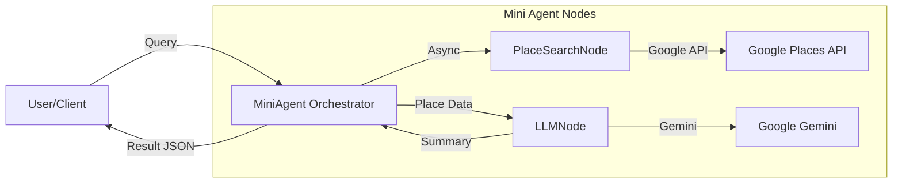

# Mini Agent Architecture & Design

## 1. Overview
**Mini Agent** is a lightweight, high-performance alternative to the main LangGraph agent, designed for specific, low-latency tasks such as quick place lookup and summary. It employs a **Node-based architecture** optimized for LangSmith tracing and asynchronous execution.

## 2. Architecture



## 3. Core Components

### A. Orchestrator (`mini_agent.py`)
- **Class**: `MiniAgent`
- **Role**: Manages the lifecycle of nodes and executes the pipeline.
- **Key Methods**:
  - `run_async(query, max_places)`: Main entry point. Executes search and summarization sequentially but handles internal I/O asynchronously.
  - `@traceable`: Decorators integration for LangSmith observability.

### B. Place Search Node (`nodes/place_search_node.py`)
- **Role**: Wraps Google Places API interactions.
- **Logic**:
  1. **Text Search**: Uses `places:searchText` endpoint to find place IDs and locations.
  2. **Detail Enrichment**: Fetches ratings, photos, and reviews for each place in parallel.
  3. **Output**: List of dictionary objects containing normalized place data.

### C. LLM Node (`nodes/llm_node.py`)
- **Role**: Generates concise summaries based on retrieved place data.
- **Model**: Google Gemini (via `langchain-google-genai`).
- **Prompt Strategy**:
  - Contextualizes place data (Name, Address, Rating, Reviews).
  - Instructs the model to output **3 bullet points** with emojis.
  - Strict character limit (15 chars per bullet) for UI friendliness.

### D. Utilities
- **`place_search.py`**: Implementation details of Google API calls.
- **`blog_search.py`**: Standalone module for Naver Blog Search & RSS parsing (available for extension, though primarily used by Main Agent).
- **`config.py`**: Centralized configuration and environment variable validation.

## 4. Key Features
1.  **Asynchronous I/O**: Uses `aiohttp` and `asyncio.gather` for parallel fetching of place details and reviews, significantly reducing latency compared to sequential requests.
2.  **LangSmith Integration**: Each node (`PlaceSearchNode`, `LLMNode`) is independently traceable, allowing for granular performance monitoring and debugging.
3.  **Lightweight**: Minimal dependencies compared to the full LangGraph setup.

## 5. Usage Example

```python
from src.mini_agent.mini_agent import MiniAgent

# Async execution
agent = MiniAgent()
result = await agent.run_async("광주 동명동 맛집", max_places=5)

print(result['answer']) 
# Output:
# • 🍝 파스타가 맛있는 핫플
# • 📸 사진 찍기 좋은 감성
# • ⭐ 4.5점의 높은 평점
```
